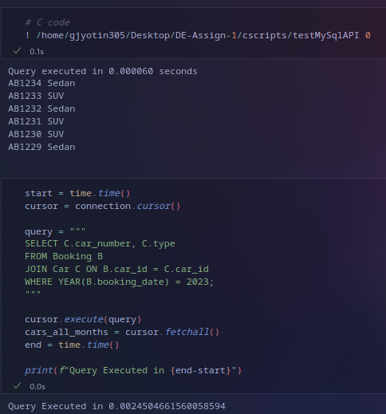

# Data Engineering : Lab Assignment 2:

[Repository Link](https://github.com/gjyotin305/DE-Assignments)

## Team Members:
- Jyotin Goel (B22AI063)
- Samay Mehar (B22AI048)


### 1. Optimized Relational Algebra Expressions

#### Query 1: Extract a list of all `<artist_name, artwork>` who have artwork listings in all months of 2023.

**Relational Algebra:**
```bash
- σ (Listing_Date ∈ (1, ..., 12) ∧ Year = 2023) (Artist ⨝ Artwork_Listing)
```

#### Query 2: From the above list, print the names of all artists who have at least one sculpture.

**Relational Algebra:**
- π_artist_name (σ_artwork_type = 'sculpture' (Artist ⨝ Artwork))

#### Query 3: Extract a list of all `<artist_profile>` information for whom the database does not have any artwork listing.

**Relational Algebra:**
```bash
- π_artist_profile (Artist) - π_artist_profile (Artist ⨝ Artwork_Listing)
```

#### Query 4: Print a list of all buyers who have made purchases of oil paintings in 2022.

**Relational Algebra:**
```bash
- π_buyer_name (σ_artwork_type = 'oil_painting' ∧ Year = 2022 (Buyer ⨝ Purchase ⨝ Artwork))
```

#### Query 5: Derive a list of the artists and their profile information.

**Relational Algebra:**
```bash
- π_artist_name, profile_info (Artist ⨝ Artwork)
```

#### Query 6: Derive a list of all `<buyer_profiles>` who have not made any purchases.

**Relational Algebra:**
```bash
- π_buyer_profile (Buyer) - π_buyer_profile (Buyer ⨝ Purchase)
```

### 2. Evaluation of Query Execution Time

The query execution times, test has been done in the notebooks, kindly refer to it for the same. 



---

### Inter-Language Differences

- **Python**: High-level abstractions make database interaction faster to write but potentially slower due to overhead.
- **C**: Executes faster due to its low-level nature but requires more complex setup (e.g., manual memory management).

### Intra-Language Differences

- **Python**: Execution time depends on the SQL driver (e.g., `sqlite3`, `mysql-connector-python`). Some libraries offer optimizations that can impact performance.
- **C**: Performance depends on the SQL library interfaces (e.g., `libmysqlclient`), and C generally runs faster for large datasets due to its closer interaction with hardware.

For accurate performance analysis, compare the time across different datasets, indexing schemes, and conditions (e.g., size of the database).