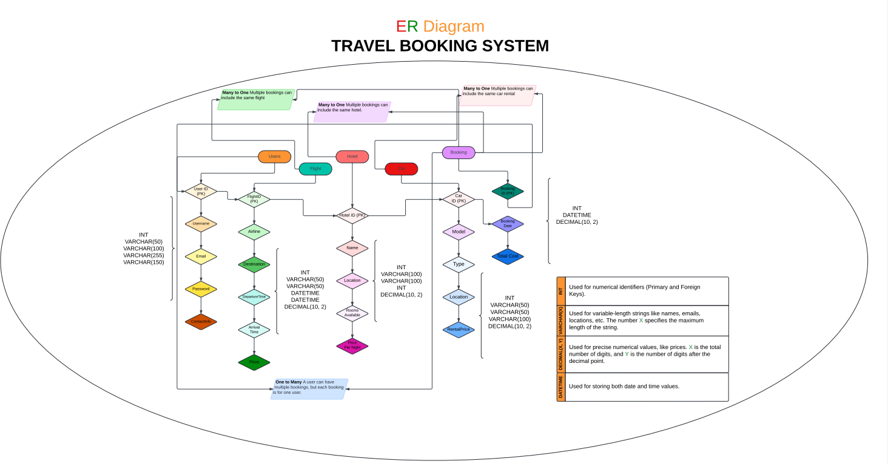

# DE-Assign-1

[Repository Link](https://github.com/gjyotin305/DE-Assign-1)

## Team Members
- Jyotin Goel (B22AI063)
- Samay Mehar (B22AI048)

## Question 1: Create an ER Diagram



## Question 2: Table Creation, insertion of dummy records in all tables - using Python interface with sql.

Please refer to the notebooks folder for the same.

## Question 3:

### Explanation for Normalization

### First Normal Form (1NF):
- **Objective**: Ensure that each table has a primary key and no repeating groups.
- **Steps**:
  - Ensure each table has a primary key.
  - Remove repeating groups or arrays by creating separate tables.
- **Example**: 
  - If a `User` table has multiple phone numbers, create a `UserPhone` table with `UserID` and `PhoneNumber` fields.

### Second Normal Form (2NF):
- **Objective**: Ensure that all non-key attributes are fully functionally dependent on the primary key.
- **Steps**:
  - Identify any attributes that are partially dependent on the primary key.
  - Move these attributes to a new table.
- **Example**:
  - If the `Booking` table contains `FlightID` and `Airline`, move `Airline` to a `Flight` table since it depends on `FlightID`.

### Third Normal Form (3NF):
- **Objective**: Ensure that all attributes are only dependent on the primary key, eliminating transitive dependencies.
- **Steps**:
  - Identify attributes that are dependent on non-primary key attributes.
  - Move these attributes to a new table where the dependency is direct on a primary key.
- **Example**:
  - If `HotelLocation` depends on `HotelID`, but `HotelName` is not a primary key, separate `HotelLocation` into another table where `HotelName` is a key.

### Trade-offs Between Normal Forms:

#### Advantages of 3NF/BCNF:
- **Reduces data redundancy**: Eliminates duplicate data, reducing storage needs.
- **Improves data integrity**: Ensures consistency in data by avoiding anomalies.
- **Makes updates more efficient**: Reduces the risk of update anomalies.

#### Disadvantages:
- **Requires more joins in queries**: May affect performance due to the need for multiple joins.
- **May lead to a more complex database schema**: The structure of the database can become more intricate, making it harder to understand.


## Question 4: Study and write a short note on the hashing and indexing schemes underlying MYSQL.

### Hashing Schemes

#### Definition:
- **Hashing** is a method of indexing and retrieving items from a database quickly by converting the search key into a location using a hash function.

### Use Cases:
- Often used in scenarios where data lookups are frequent and fast data retrieval is needed.

### Types:
- Commonly used hash functions include:
  - **MD5**
  - **SHA** (Secure Hash Algorithms)

#### MySQL Use:
- MySQL uses hash indexing for **MEMORY (HEAP)** storage engines.
- Provides fast access but does not support range searches.

### Indexing Schemes

#### B-Tree Indexes:
- **Most common type of index in MySQL**.
- Balanced tree structure allows fast lookup, insertion, and deletion.

#### Full-Text Indexes:
- Used for **full-text searches**.
- Common in applications where text data is frequently searched.

#### Spatial Indexes:
- Used for **spatial data types** like points, lines, and polygons.
- Commonly used in geographical applications.

## Question 5: Design a hash function (using Python) - that take into consideration alphabets common in all the roll numbers of the group-members - for effective storage/retrieval of data - on the ‘Booking’ table

```python
def custom_hash_function(roll_number):
    # Extract the common parts 'B', '2', 'A', 'I' / Common Characters in Roll Number
    prefix = ''.join([char for char in roll_number if char in 'B2AI'])
    
    # Extract the numerical part
    numerical_part = ''.join(filter(str.isdigit, roll_number))
    
    # Combine and hash the result
    combined_key = prefix + numerical_part
    
    # Simple hash by summing ASCII values and taking modulus with large prime number
    hash_value = sum(ord(char) for char in combined_key) % 100007  
    
    return hash_value
```

### Explanation:

- **Common Characters**: We focus on the common characters `'B'`, `'2'`, `'A'`, `'I'`.
- **Numerical Part**: We extract the digits from the roll number.
- **Combined Key**: The combined key is formed by concatenating the common characters and the numerical part.
- **Hashing**: The hash value is computed by summing the ASCII values of the combined key's characters and then taking the modulus to keep the value within a desired range.

## Question 6: Apply clustering indexing on the data (using Python) in the ‘Booking’ table

Kindly check the notebooks section of the repository for the same.

## Question 7: Apply secondary indexing on the data (using Python) in the ‘Booking’ table

Kindly check the notebooks section of the repository for the same.

## Question 8: Compare and contrast between the storage and execution time of the clustering vs secondary indexing schemes designed by you

Comparison is given in the notebook itself.

## Question 9: Besides the SQL queries for the aforementioned operations, write queries to:

1. **Add information about the inclusion of information on 5 new users**
2. **Prepare a report on all bookings made in the month of August, 2024**
3. **Remove all user profiles made after 7 PM on August 15, 2024**

Please refer to the notebooks section of the repository for the same.

## Instructions to run the interface

### Step 1: Create a Python venv
```bash
python -m venv de_assign_1_jyotin
```

### Step 2: Activate the venv
```bash
source de_assign_1_jyotin/bin/activate
```

### Install the requirements
```bash
pip install -r requirements.txt
```

### Run the Interface
```bash
streamlit run main.py
```